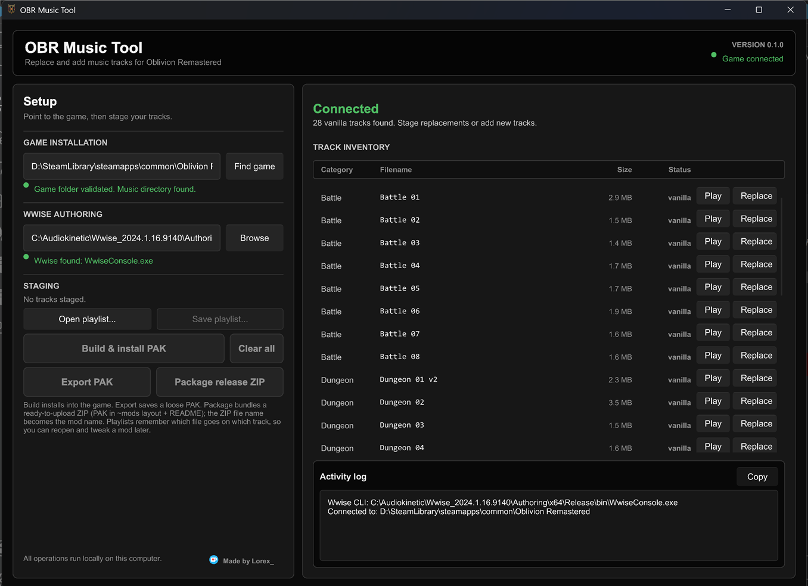

<p align="center"></p>

# OBR Music Tool

Replace the music in **The Elder Scrolls IV: Oblivion Remastered** with your own tracks.
Pick a song for any of the game's 28 music tracks, click one button, and play — no Unreal Engine,
no hex editing, no hand-built soundbanks. Everything runs locally on your PC.



## What it does

- **Lists every vanilla music track** — Battle, Dungeon, Explore, Public (towns) and Special (title screen, death, success) — with built-in preview playback so you know which track you are replacing.
- **Accepts normal audio files** as replacements: `.mp3`, `.wav`, `.ogg`, `.flac` (or pre-encoded `.wem`).
- **Converts them to the game's format** (Wwise Vorbis `.wem`) using Audiokinetic's own encoder, so the output is exactly what the game expects.
- **Builds a UE5 patch `.pak`** that overrides the original tracks. Your game files are never modified — delete the pak and everything is vanilla again.
- **Three ways to get the result out:**
  - **Build & install PAK** — writes the pak straight into your game's `Paks` folder. Launch the game and you're done.
  - **Export PAK** — saves a loose `.pak` wherever you like.
  - **Package release ZIP** — produces a ready-to-upload mod archive (pak in the standard `~mods` layout plus a generated `README.txt` listing the replaced tracks). The zip's file name becomes the mod's name.
- **Saves playlists** — a small `.obrplaylist` file remembers which audio file goes on which track, so you can reopen a mod later, swap a few songs and rebuild without redoing the rest.

> **Scope:** the tool *replaces* the existing 28 tracks. Adding brand-new tracks to the playlist is not supported, because which tracks play (and when) is defined inside the game's Wwise soundbanks, not by the audio files.

## Requirements

| Requirement | Notes |
|---|---|
| **Windows 10 / 11 (64-bit)** | The tool, and Wwise Authoring, are Windows-only. |
| **Oblivion Remastered** | Steam and Xbox / Game Pass installs are auto-detected. |
| **Wwise Authoring** (free) | Needed to convert audio into `.wem`. About 2 GB. See [Installing Wwise](#installing-wwise) below. *Not* needed if you only feed the tool pre-encoded `.wem` files. |

No admin rights are required and the tool never connects to the internet.

## Installing Wwise

### Why is this needed?

Oblivion Remastered plays its music through **Audiokinetic Wwise**. Each track is stored as a `.wem`
file — a Wwise-specific container around Vorbis audio. The encoder that produces compatible `.wem` files
is part of Wwise Authoring, which is free to download and use but cannot be redistributed with this tool.
So you install it once yourself, and OBR Music Tool drives its command-line converter (`WwiseConsole.exe`)
behind the scenes. You never have to open Wwise.

### Steps

1. **Get the Audiokinetic Launcher.** Go to <https://www.audiokinetic.com/download/>, create a free
   Audiokinetic account if you don't have one, and download and install the Launcher.
2. **Install a Wwise version.** Open the Launcher, go to the **Wwise** tab, and click
   **Install a Wwise version**. Any recent version works (the tool was developed against 2024.1.x).
3. **Trim the install.** On the options page, select only what is needed — this keeps the download at
   roughly 2 GB instead of 10+:
   - **Packages:** tick **Authoring**. Untick *SDK (C++)*, *Documentation* and *Samples*.
   - **Deployment Platforms:** leave **Windows** ticked (it is by default). Untick everything else.
   - **Plug-ins:** none are needed.
4. **Install.** The default location is something like
   `C:\Program Files (x86)\Audiokinetic\Wwise 2024.1.16.9140\` (or `C:\Audiokinetic\Wwise ...` on older Launchers).
5. **Start OBR Music Tool.** It looks for `Authoring\x64\Release\bin\WwiseConsole.exe` automatically in
   Program Files, in any `Audiokinetic` folder on any drive, and in the `WWISEROOT` environment variable.
   The *Wwise Authoring* line in the Setup panel turns green when it is found.

   If it says *Wwise not found*, click **Browse** and choose the **Wwise version folder** — the one that
   contains the `Authoring` subfolder (e.g. `...\Audiokinetic\Wwise 2024.1.16.9140`).

You can uninstall Wwise from the Launcher at any time; only the `.wem` conversion depends on it.

## Usage

1. **Launch `obr-music-tool.exe`.** The game folder is detected automatically (Steam registry, Steam
   libraries, Game Pass). If not, click **Find game** or paste the install folder into the field.
2. **Check the Setup panel.** Both *Game installation* and *Wwise Authoring* should be green.
3. **Choose your tracks.** In the inventory, click **Play** to hear the original, then **Replace** to pick
   an audio file for it. Queued tracks show the chosen file name in orange; **Remove** un-queues one and
   **Clear all** resets everything. Replacement tracks can be any length, sample rate or channel layout.
4. **Produce the output:**
   - **Build & install PAK** writes `OblivionRemastered\Content\Paks\zzz_MusicMod_P.pak` into your game.
     Start the game — the new music is live.
   - **Export PAK** asks where to save a loose `.pak` (drop it into `Content\Paks` or `Content\Paks\~mods` to use it).
   - **Package release ZIP** asks for a zip name, e.g. `EpicBattleMusic.zip`, and produces:
     ```
     EpicBattleMusic.zip
     ├── OblivionRemastered/Content/Paks/~mods/EpicBattleMusic_P.pak
     └── README.txt   (install instructions + list of replaced tracks)
     ```
     That layout installs cleanly through Vortex / MO2 and by extracting into the game folder, so it
     can go straight to Nexus Mods.
   Export and Package first show a short copyright reminder — only share music you own, have permission to
   redistribute, or that is free to use (see [Legal](#legal)). Tick *Don't show this again* to skip it in future; delete
   `%LOCALAPPDATA%\OBRMusicTool\export-warning-acknowledged` to bring it back.
5. **Open output** (in the Activity log header) reveals the finished file in Explorer.
6. **Save playlist…** to keep your selection. **Open playlist…** restores it later, so you can change a
   couple of tracks and rebuild. Playlists are plain text (`<wwise id> = <path>` per track), so they can be
   edited by hand; files that have moved are skipped and listed in the log.

Encoding runs in the background with a progress bar; the Activity log records every step and can be copied
with one click if you need to report a problem.

**Uninstall a music mod:** delete the `.pak` file. Nothing else is touched.

## How it works

1. Each of the 28 tracks is mapped to the numeric Wwise media ID the game uses for it.
2. Your audio is decoded to 16-bit PCM WAV (pre-encoded `.wem` files are copied as-is).
3. `WwiseConsole.exe` converts the WAV with the *Vorbis Quality High* preset inside a throwaway Wwise
   project in `%TEMP%\obr-music-wem`.
4. The resulting `.wem` files are written into a UE5 (v11) pak at
   `OblivionRemastered/Content/WwiseAudio/Media/<id>.wem` with the standard `../../../` mount point.
5. Because the file name ends in `_P`, Unreal loads it as a patch pak and it takes priority over the
   original media — which is why the replacement works without touching the game's soundbanks.

## Track list

| Category | Tracks | Original files |
|---|---|---|
| Battle | Battle 01 – 08 | `battle_01.mp3` … `battle_08.mp3` |
| Dungeon | Dungeon 01 v2, Dungeon 02 – 05 | `Dungeon_01_v2.mp3`, `dungeon_02.mp3` … `dungeon_05.mp3` |
| Explore | Atmosphere 01, 03, 04, 06, 07, 08, 09 | `atmosphere_01.mp3` … `atmosphere_09.mp3` |
| Public | Town 01 – 05 | `town_01.mp3` … `town_05.mp3` |
| Special | Title Screen, Death, Success | `tes4title.mp3`, `death.mp3`, `success.mp3` |

## Troubleshooting

| Symptom | What to check |
|---|---|
| *Wwise not found* | Click **Browse** and select the Wwise **version** folder (the one containing `Authoring`). Or set the `WWISEROOT` environment variable to it. |
| *WwiseConsole conversion failed* | Make sure the **Windows** deployment platform was included in the Wwise install. Try re-saving the source as `.wav`; confirm the file plays in a normal media player. |
| Build succeeds but the music is unchanged in-game | Confirm the pak is in `OblivionRemastered\Content\Paks` (or `Paks\~mods`) and its name ends with `_P.pak`. Remove other music mods that replace the same tracks. |
| Game not detected | Click **Find game** and pick the install folder — the one that contains `OblivionRemastered` and `Engine`. You can also set `OBLIVION_REMASTERED_ROOT`. |
| Preview says *packed inside IoStore* | That track has no loose `.mp3` in your install, so it cannot be previewed. Replacing it still works. |

## Building from source

Requires a stable Rust toolchain (MSVC target) on Windows.

```
git clone https://github.com/LorexValkin/OBR-Music-Tool.git
cd OBR-Music-Tool
cargo build --release
```

The executable is written to `target\release\obr-music-tool.exe`. Run `cargo test` for the unit tests.

The app icon lives in `ui/assets/icon.svg`; the `icon.png` (window icon) and `icon.ico` (exe icon) next to it
are generated from it with:

```
cargo run --release --manifest-path tools/icongen/Cargo.toml -- ui/assets/icon.svg ui/assets
```

Built with [Slint](https://slint.dev) (UI), [repak](https://github.com/trumank/repak) (pak writer),
[rodio](https://github.com/RustAudio/rodio) (audio decoding and preview) and [zip](https://github.com/zip-rs/zip2).

## Legal

**Music copyright is your responsibility.** This tool only repackages audio you supply. Before uploading a
music mod anywhere, make sure every track is one of the following:

- your own work,
- music the rights holder has explicitly allowed you to redistribute, or
- music that is free to use — royalty-free, Creative Commons, public domain or a similar open license
  (read the terms; many require you to credit the artist).

Distributing copyrighted music without permission can lead to takedown notices, account strikes or legal
action, and the developer of OBR Music Tool accepts no responsibility for any of that.

## License

OBR Music Tool is **free to use, modify and share** under the [OBR Music Tool License](LICENSE). The short
version:

- **No paywalls.** Neither the tool nor any mod made with it may be sold or locked behind a paywall,
  early-access tier, subscription or "supporter-only" download.
- **Donations are fine.** Ko-fi / PayPal / Patreon links are welcome, as long as the same files are available
  to everyone for free at the same time.
- **Forks keep the same terms**, and the usual attribution and no-warranty clauses apply.

## Support

Made by Lorex. If the tool saved you an evening, you can [buy me a coffee](https://ko-fi.com/lorex_).

*Wwise is a trademark of Audiokinetic Inc. This project is not affiliated with Audiokinetic, Bethesda Softworks or Virtuos.*
