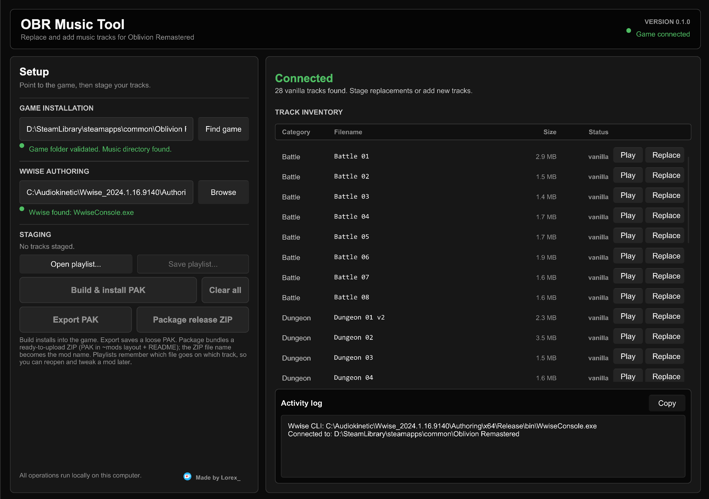
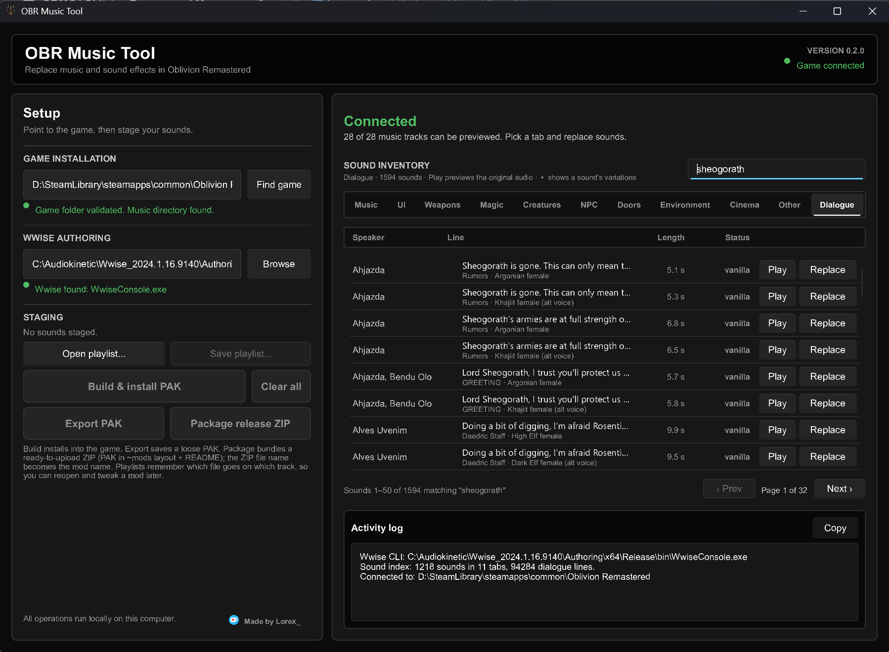

# OBR Music Tool

Replace the music **and sound effects** in **The Elder Scrolls IV: Oblivion Remastered** with your own audio.
Pick a file for any of the game's 28 music tracks or ~1,190 sound effects (doors and chests, weapons, spells,
creatures, menus, ambience, weather...), click one button, and play. No Unreal Engine, no hex editing, no
hand-built soundbanks. Everything runs locally on your PC.



## Download

Get the latest build from the [Releases page](https://github.com/LorexValkin/OBR-Music-Tool/releases). Unzip it
anywhere and run `obr-music-tool.exe`; there is no installer and no admin rights are needed. Current builds are
**alpha** releases, so keep a copy of your playlist and report anything odd with the Activity log attached.

**About the signature.** Release builds are code-signed with the certificate of Computer Works, the developer's
company, so Windows can verify the file came from us and was not tampered with. That is all the signature means:
OBR Music Tool is still a free, open-source hobby project by Lorex under the [OBR Music Tool License](LICENSE),
not a commercial product. A brand-new build may still get a SmartScreen "unrecognized app" prompt (click *More
info* > *Run anyway*) until it builds up download reputation, and a lone antivirus hit on VirusTotal from a
machine-learning engine is a false positive. The source is right here if you would rather build it yourself.

Before converting audio you will need Wwise Authoring installed once; see [Installing Wwise](#installing-wwise).

## What it does

- **Lists every vanilla music track, sound effect and voice line** in tabs: Music, Menu & UI, Weapons, Magic,
  Creatures, Player & NPC, Doors/Chests/Traps, Environment & Weather, Cinematics, Other and Dialogue, with a search
  box for each tab. Sounds carry the game's own names (for example `obj_drs_chest_open`, source file
  `al_obj_drs_chest_open.wav`), so you are never guessing from numeric ids. The Dialogue tab lists all 94,284 voice
  recordings with the speaker, the subtitle text and the voice type. Tabs show 50 sounds per page; the search box
  covers the whole tab.
- **Previews everything.** Music plays from the game's loose mp3s; sound effects are read straight out of the
  game's pak (read-only) and decoded in the app. Sounds with several *variations* expand (click the arrow or
  double-click the row) so each variation can be previewed or replaced on its own, and every row shows its play
  length.
- **Accepts normal audio files** as replacements: `.mp3`, `.wav`, `.ogg`, `.flac` (or pre-encoded `.wem`).
- **Converts them to the game's format** (Wwise Vorbis `.wem`) using Audiokinetic's own encoder, so the output is exactly what the game expects.
- **Builds a UE5 patch `.pak`** that overrides the original tracks. Your game files are never modified; delete the pak and everything is vanilla again.
- **Three ways to get the result out:**
  - **Build & install PAK**: writes the pak straight into your game's `Paks` folder. Launch the game and you're done.
  - **Export PAK**: saves a loose `.pak` wherever you like.
  - **Package release ZIP**: produces a ready-to-upload mod archive (pak in the standard `~mods` layout plus a generated `README.txt` listing the replaced tracks). The zip's file name becomes the mod's name.
- **Saves playlists**: a small `.obrplaylist` file remembers which audio file goes on which track, so you can reopen a mod later, swap a few songs and rebuild without redoing the rest.

> **Scope:** the tool *replaces* existing sounds. Adding brand-new tracks or sounds is not supported, because which
> sounds play (and when) is defined inside the game's Wwise soundbanks, not by the audio files. Voice lines are
> replaced per recording; the subtitles and the conditions for when a line is spoken stay as they are.

## Requirements

| Requirement | Notes |
|---|---|
| **Windows 10 / 11 (64-bit)** | The tool, and Wwise Authoring, are Windows-only. |
| **Oblivion Remastered** (Steam) | The Steam install is auto-detected; you can also point the tool at the folder by hand. Xbox app / Game Pass installs are not supported. |
| **Wwise Authoring** (free) | Needed to convert audio into `.wem`. About 2 GB. See [Installing Wwise](#installing-wwise) below. *Not* needed if you only feed the tool pre-encoded `.wem` files. |

No admin rights are required and the tool never connects to the internet.

## Installing Wwise

### Why is this needed?

Oblivion Remastered plays its music through **Audiokinetic Wwise**. Each track is stored as a `.wem`
file, a Wwise-specific container around Vorbis audio. The encoder that produces compatible `.wem` files
is part of Wwise Authoring, which is free to download and use but cannot be redistributed with this tool.
So you install it once yourself, and OBR Music Tool drives its command-line converter (`WwiseConsole.exe`)
behind the scenes. You never have to open Wwise.

### Steps

1. **Get the Audiokinetic Launcher.** Go to <https://www.audiokinetic.com/download/>, create a free
   Audiokinetic account if you don't have one, and download and install the Launcher.
2. **Install a Wwise version.** Open the Launcher, go to the **Wwise** tab, and click
   **Install a Wwise version**. Any recent version works (the tool was developed against 2024.1.x).
3. **Trim the install.** On the options page, select only what is needed; this keeps the download at
   roughly 2 GB instead of 10+:
   - **Packages:** tick **Authoring**. Untick *SDK (C++)*, *Documentation* and *Samples*.
   - **Deployment Platforms:** leave **Windows** ticked (it is by default). Untick everything else.
   - **Plug-ins:** none are needed.
4. **Install.** The default location is something like
   `C:\Program Files (x86)\Audiokinetic\Wwise 2024.1.16.9140\` (or `C:\Audiokinetic\Wwise ...` on older Launchers).
5. **Start OBR Music Tool.** It looks for `Authoring\x64\Release\bin\WwiseConsole.exe` automatically in
   Program Files, in any `Audiokinetic` folder on any drive, and in the `WWISEROOT` environment variable.
   The *Wwise Authoring* line in the Setup panel turns green when it is found.

   If it says *Wwise not found*, click **Browse** and choose the **Wwise version folder**, the one that
   contains the `Authoring` subfolder (e.g. `...\Audiokinetic\Wwise 2024.1.16.9140`).

You can uninstall Wwise from the Launcher at any time; only the `.wem` conversion depends on it.

## Usage

1. **Launch `obr-music-tool.exe`.** The game folder is detected automatically (Steam registry, Steam
   libraries, Game Pass). If not, click **Find game** or paste the install folder into the field.
2. **Check the Setup panel.** Both *Game installation* and *Wwise Authoring* should be green.
3. **Choose your sounds.** Pick a tab at the top of the inventory (Music, Menu & UI, Weapons, ...) and use the
   search box to filter it; searching matches the sound name, its group and its source file name, across the whole
   tab (the list shows 50 sounds per page). Click **Play** to hear the original; sound effects are read straight from
   the game files. Click **Replace** to pick an audio file for a sound. A sound with *N variations* (random
   alternatives the game picks from) gets the same file on all of them; click the small arrow next to its name (or
   double-click the row) to list the variations and play, replace or remove each one individually (the sound then shows as *partial* until
   every variation is replaced). Queued sounds show the chosen file name in orange and a badge on their tab;
   **Remove** un-queues one and **Clear all** resets everything. Replacement audio can be any length, sample rate
   or channel layout.

   Some sounds *share audio* with others (one menu click is used by 90 different actions); the app says so when
   you replace one of them, and the other sounds then show as *partial* or *replace* too. A few weapon-impact
   sounds are marked *may not replace cleanly*: their soundbank embeds its own copy of the audio, so the
   replacement might only partly take effect in-game. Sounds marked *generated by a Wwise plugin* have no audio
   file and cannot be replaced.

   In the **Dialogue** tab each row is one recording: the speaker (a named NPC, or *Any Orc female* for lines every
   NPC of that race can say), the subtitle, and underneath it the topic and the voice type. Search matches all of
   those, so `haskill`, `sheogorath greeting` or `orc female rumors` work. The game shares recordings between
   races (Dark Elf and Wood Elf lines use the High Elf actor, Orc uses Nord, Khajiit uses Argonian, Breton uses
   Imperial); a shared recording is listed once and replacing it changes it for every race that plays it.
4. **Produce the output:**
   - **Build & install PAK** writes `OblivionRemastered\Content\Paks\zzz_MusicMod_P.pak` into your game.
     Start the game and the new music is live.
   - **Export PAK** asks where to save a loose `.pak` (drop it into `Content\Paks` or `Content\Paks\~mods` to use it).
   - **Package release ZIP** asks for a zip name, e.g. `EpicBattleMusic.zip`, and produces:
     ```
     EpicBattleMusic.zip
     ├── OblivionRemastered/Content/Paks/~mods/EpicBattleMusic_P.pak
     └── README.txt   (install instructions + list of replaced tracks)
     ```
     That layout installs cleanly through Vortex / MO2 and by extracting into the game folder, so it
     can go straight to Nexus Mods.
   Export and Package first show a short copyright reminder: only share music you own, have permission to
   redistribute, or that is free to use (see [Legal](#legal)). Tick *Don't show this again* to skip it in future; delete
   `%LOCALAPPDATA%\OBRMusicTool\export-warning-acknowledged` to bring it back.
5. **Open output** (in the Activity log header) reveals the finished file in Explorer.
6. **Save playlist…** to keep your selection. **Open playlist…** restores it later, so you can change a
   couple of tracks and rebuild. Playlists are plain text (`<wwise id> = <path>` per track), so they can be
   edited by hand; files that have moved are skipped and listed in the log.

Encoding runs in the background with a progress bar; the Activity log records every step and can be copied
with one click if you need to report a problem.

**Uninstall a music mod:** delete the `.pak` file. Nothing else is touched.

## How it works

1. Every sound (28 music tracks and ~1,200 effects, ~5,700 audio files) is mapped to the numeric Wwise media
   ids the game uses for it by an index that ships inside the exe (`assets/sfx_index.bin`). The index is built
   offline from the game files by `tools/sfxindex`, which reads the cooked Wwise event assets: they name the
   event, its `Media/<id>.wem` files and the original source `.wav` each one was made from. A second index
   (`assets/voice_index.bin`, stored compressed, decoded once on first use) maps the 94,284 voice recordings to their
   dialogue lines: the voice events name the recording, the game's plugins (`Oblivion.esm` and the DLC `.esp` files
   under `Dev/ObvData/Data`) describe the line (quest, topic, speaker conditions, subtitle) and the English text
   table `Localization/Game/en/Game.locres` turns the plugins' localisation keys into names and subtitles.
2. Your audio is decoded to 16-bit PCM WAV (pre-encoded `.wem` files are copied as-is).
3. `WwiseConsole.exe` converts the WAV with the *Vorbis Quality High* preset inside a throwaway Wwise
   project in `%TEMP%\obr-music-wem`. Each source file is encoded once, however many sounds it is assigned to.
4. The resulting `.wem` files are written into a UE5 (v11) pak at
   `OblivionRemastered/Content/WwiseAudio/Media/<id>.wem` (voice lines: `Media/English(US)/<id>.wem`) with the
   standard `../../../` mount point, one entry per replaced audio file (so a 3-variation sound becomes 3 entries).
6. Preview reads the original `.wem` out of the game's main pak (read-only; Oodle-compressed entries are
   decompressed with [oozextract](https://crates.io/crates/oozextract)), rebuilds Wwise Vorbis into a standard Ogg
   stream with [ww2ogg](https://crates.io/crates/ww2ogg), decodes Wwise Opus with
   [opus-decoder](https://crates.io/crates/opus-decoder) and plays it back in the app.
5. Because the file name ends in `_P`, Unreal loads it as a patch pak and it takes priority over the
   original media, which is why the replacement works without touching the game's soundbanks.

## What is in each tab

| Tab | Contents | Sounds |
|---|---|---|
| Music | The 28 music tracks (table below) | 28 |
| Menu & UI | Menus, HUD, item pickup/equip, lockpicking and other minigames, volume-slider test sounds | 230 |
| Weapons | Melee impacts, blocks, swings, bows and weapon equip/inventory sounds | 52 |
| Magic | Spell casts, impacts, barriers and effects by school | 70 |
| Creatures | Every creature's vocals, footsteps and foley, grouped by creature | 336 |
| Player & NPC | Character footsteps, foley (eating, torches, swimming...) and vocal efforts | 31 |
| Doors, Chests & Traps | Doors and gates, containers, traps | 210 |
| Environment & Weather | Ambience beds, object emitters (fires, waterfalls, chimes...), weather, crowds, physics impacts | 240 |
| Cinematics | Intro logos, Emperor's death, endgame | 16 |
| Other | Controller haptics and test beeps | 5 |
| Dialogue | Every voice recording with its speaker, subtitle, topic and voice type (race, sex, alternative voices) | 94,284 recordings |



Counts are sounds (events); many have several variations, ~5,700 audio files in total. Every sound that carries
audio is listed somewhere; the only things left out are engine objects without audio (buses, mixer settings, "stop"
events).

## Track list

| Category | Tracks | Original files |
|---|---|---|
| Battle | Battle 01-08 | `battle_01.mp3` … `battle_08.mp3` |
| Dungeon | Dungeon 01 v2, Dungeon 02-05 | `Dungeon_01_v2.mp3`, `dungeon_02.mp3` … `dungeon_05.mp3` |
| Explore | Atmosphere 01, 03, 04, 06, 07, 08, 09 | `atmosphere_01.mp3` … `atmosphere_09.mp3` |
| Public | Town 01-05 | `town_01.mp3` … `town_05.mp3` |
| Special | Title Screen, Death, Success | `tes4title.mp3`, `death.mp3`, `success.mp3` |

> **Title Screen music loops on a fixed timing.** The game's title music is set up in Wwise to loop seamlessly at a
> specific point in the track. A replacement of a different length will not line up with that loop point, so it may
> loop with a gap, restart mid-phrase or cut off. If you replace it, trim your file so it loops cleanly on its own, or
> expect the seam to be audible.

## Troubleshooting

| Symptom | What to check |
|---|---|
| *Wwise not found* | Click **Browse** and select the Wwise **version** folder (the one containing `Authoring`). Or set the `WWISEROOT` environment variable to it. |
| *WwiseConsole conversion failed* | Make sure the **Windows** deployment platform was included in the Wwise install. Try re-saving the source as `.wav`; confirm the file plays in a normal media player. |
| Build succeeds but the music is unchanged in-game | Confirm the pak is in `OblivionRemastered\Content\Paks` (or `Paks\~mods`) and its name ends with `_P.pak`. Remove other music mods that replace the same tracks. |
| Game not detected | Click **Find game** and pick the install folder, the one that contains `OblivionRemastered` and `Engine`. You can also set `OBLIVION_REMASTERED_ROOT`. Xbox app / Game Pass installs are not supported. |
| Title screen music loops with a gap or cuts off | The title track loops at a fixed point set inside the game; see the note under the track list. Trim the replacement so it loops on its own. |
| A music track has no Play button / the log says it cannot be played | That track has no loose `.mp3` in your install, so it cannot be previewed. Replacing it still works. |
| Play on a sound effect says it cannot be previewed | Connect the game folder first; previews are read from the game's pak. Sounds marked *generated by a Wwise plugin* have no audio file and can be neither previewed nor replaced. |
| Replacing one sound changed others too | Those sounds share the same audio file inside the game (the app notes this when you replace them). Removing the replacement on any of them clears it for all. |
| A weapon impact only partly changed in-game | Its soundbank embeds a copy of the audio; the app marks such sounds *may not replace cleanly*. Replacing the loose file cannot change the embedded copy. |
| The tool shows a sound that no longer exists after a game update | The sound index is built from a specific game version; rebuild it with `tools/sfxindex` (see below) or wait for an update. |

## Building from source

Requires a stable Rust toolchain (MSVC target) on Windows.

```
git clone https://github.com/LorexValkin/OBR-Music-Tool.git
cd OBR-Music-Tool
cargo build --release
```

The executable is written to `target\release\obr-music-tool.exe`. Run `cargo test` for the unit tests.

### Regenerating the sound index

`assets/sfx_index.bin` (and its readable twin `assets/sfx_index.tsv`) list every replaceable sound with its tab,
group, Wwise media ids and source file name; `assets/voice_index.bin` (deflated) holds the dialogue lines. They are
generated from an installed copy of the game and committed, so building the app never needs the game. After a game
update, rebuild them with:

```
cargo run --release --manifest-path tools/sfxindex/Cargo.toml -- "D:\SteamLibrary\steamapps\common\Oblivion Remastered" --out assets
```

Any install root works (any drive); the tool finds the `Paks` folder itself, reads the plugins from
`Dev/ObvData/Data` and the English text from the pak's `Game.locres` (`--no-voice` skips the dialogue index). Add
`--check` to verify the committed files are still up to date without writing. `cargo test --manifest-path tools/sfxindex/Cargo.toml`
runs the builder's own tests, including a golden test over the committed `.tsv`. Both the app (sound preview) and
the builder decompress Oodle with the pure-Rust [oozextract](https://crates.io/crates/oozextract); the app only ever
reads the game's pak and never modifies it.

The app icon lives in `ui/assets/icon.svg`; the `icon.png` (window icon) and `icon.ico` (exe icon) next to it
are generated from it with:

```
cargo run --release --manifest-path tools/icongen/Cargo.toml -- ui/assets/icon.svg ui/assets
```

Built with [Slint](https://slint.dev) (UI), [repak](https://github.com/trumank/repak) (pak writer),
[rodio](https://github.com/RustAudio/rodio) (audio decoding and preview), [zip](https://github.com/zip-rs/zip2),
[oozextract](https://github.com/lvlvllvlvllvlvl/oozextract) (Oodle decompression),
[ww2ogg](https://github.com/coconutbird/ww2ogg-rs) (Wwise Vorbis to Ogg) and
[opus-decoder](https://crates.io/crates/opus-decoder) (Wwise Opus).

### Releasing

Releases are built and code-signed by the [Release workflow](.github/workflows/release.yml). Bump `version` in
`Cargo.toml`, commit, then tag and push:

```
git tag v0.1.0-alpha.2
git push --tags
```

The workflow runs the tests, builds, signs `obr-music-tool.exe` with the Computer Works certificate through Azure
Artifact Signing (GitHub's OIDC token, no stored secrets), verifies the signature and opens a **draft** release
with the zip, the bare exe and a `SHA256SUMS.txt`. Review the draft and publish it. The one-time Azure/GitHub
wiring is `tools\setup-ci-signing.ps1`; `tools\sign-release.ps1` does the same build-sign-package locally.

## Legal

**Music copyright is your responsibility.** This tool only repackages audio you supply. Before uploading a
music mod anywhere, make sure every track is one of the following:

- your own work,
- music the rights holder has explicitly allowed you to redistribute, or
- music that is free to use: royalty-free, Creative Commons, public domain or a similar open license
  (read the terms; many require you to credit the artist).

Distributing copyrighted music without permission can lead to takedown notices, account strikes or legal
action, and the developer of OBR Music Tool accepts no responsibility for any of that.

## License

OBR Music Tool is **free to use, modify and share** under the [OBR Music Tool License](LICENSE). The short
version:

- **No paywalls.** Neither the tool nor any mod made with it may be sold or locked behind a paywall,
  early-access tier, subscription or "supporter-only" download.
- **Donations are fine.** Ko-fi / PayPal / Patreon links are welcome, as long as the same files are available
  to everyone for free at the same time.
- **Forks keep the same terms**, and the usual attribution and no-warranty clauses apply.

## Support

Made by Lorex. If the tool saved you an evening, you can [buy me a coffee](https://ko-fi.com/lorex_).

*Wwise is a trademark of Audiokinetic Inc. This project is not affiliated with Audiokinetic, Bethesda Softworks or Virtuos.*
